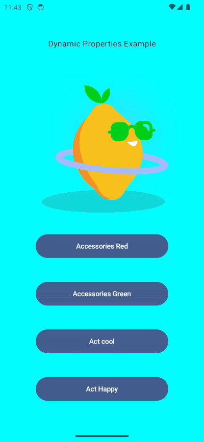

# Android Dynamic Animated SVGs (with Lottie)

Blog: url coming soon

This demo project shows how to control Lottie Dynamic Properties in a Lottie SVG image.

https://airbnb.gitbook.io/lottie/android/dynamic-properties

The crux of dynamic properties is summarised in this quote:

> To understand how to change animation properties in Lottie, you should first understand how animation properties are stored in Lottie.
> Animation properties are stored in a data tree that mimics the information hierarchy of After Effects. In After Effects a Composition is a
> collection of Layers that each have their own timelines. Layer objects have string names, and their contents can be an image, shape layers,
> fills, strokes, or just about anything that is drawable. Each object in After Effects has a name. Lottie can find these objects and
> properties by their name using a KeyPath.

And to understand those KeyPaths, the answer is not in the source json files but in the resolved file. The blog explains how to get these,
for our example you can find the resolved paths in the local file [resolved-keypaths.txt](resolved-keypaths.txt).

This app downloads the lottie file from here: https://drive.google.com/uc?id=1ebWqd_e2ci4kSKB83e37q2Bl0YMadwxv thus showing how you can
control the dynamic properties of a lottie image (by knowing the collection of Layers), as well as control the source of that image
remotely.

If you are interested in looking at that json file, a local version in in this repo [lemon-lottie.json](lemon-lottie.json).

The app running:

